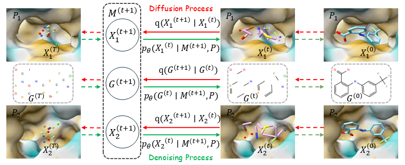
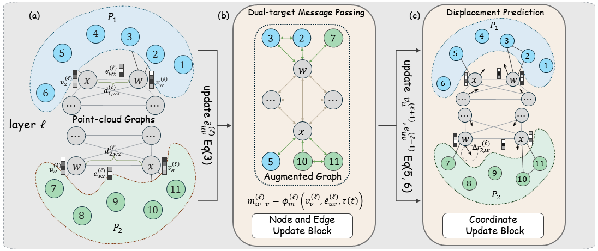

# FuseDiff: Symmetry-Preserving Joint Diffusion for Dual-Target Structure-Based Drug Design

This repository is the official implementation of **"FuseDiff: Symmetry-Preserving Joint Diffusion for Dual-Target Structure-Based Drug Design"**.

## Paper

- arXiv: [2603.05567](https://arxiv.org/abs/2603.05567)

## Overview

<!-- Main figure 1 (paper teaser / method overview) -->
<p align="center">
  
</p>

<!-- Main figure 2 (results / pipeline / qualitative examples) -->
<p align="center">
  
</p>

## Data

### Data Sources

- **BN2-DT** is derived from the BindingNet v2 high-quality subset: [Zenodo 11218329](https://zenodo.org/records/11218329).
  We filter and pair samples from the original dataset to construct BN2-DT. Therefore, we do **not** release raw BindingNet v2 data. The constructed BN2-DT pairs are defined in `data/high_dual_pairs.pkl`, where each pair is identified by sample IDs from the original BindingNet v2 high subset.
  The construction script is available at `scripts/derive_dual_datasets/derive_BN2DT.py`.
- **DDF** comes from Zhou et al., *Reprogramming Pretrained Target-Specific Diffusion Models for Dual-Target Drug Design* (NeurIPS 2024). Please follow the instructions in the original repository: [DualDiff](https://github.com/zhouxiangxin1998/DualDiff).

### Released Files

- `BindingNetV2_dualdata_high_processed_final.lmdb`: processed BN2-DT training data for direct use in training

Place the downloaded file under `data/`.

Download: [Google Drive](https://drive.google.com/drive/folders/1jUl13a7nX1oXfdongZ5HV4zmW4n-MXgG?usp=sharing)

### Dataset Citation

If you use these datasets, please cite the original authors:

```bibtex
@dataset{zhu_2024_11218329,
  author       = {Zhu, Hui and Huang, Niu},
  title        = {High quality subset of BindingNet v2 Dataset},
  month        = may,
  year         = 2024,
  publisher    = {Zenodo},
  doi          = {10.5281/zenodo.11218329},
  url          = {https://doi.org/10.5281/zenodo.11218329},
}
```

```bibtex
@inproceedings{zhou2024reprogramming,
  title={Reprogramming Pretrained Target-Specific Diffusion Models for Dual-Target Drug Design},
  author={Xiangxin Zhou and Jiaqi Guan and Yijia Zhang and Xingang Peng and Liang Wang and Jianzhu Ma},
  booktitle={The Thirty-eighth Annual Conference on Neural Information Processing Systems},
  year={2024},
}
```

## Pretrained Model

- `pretrained_FuseDiff.pt`: pretrained FuseDiff checkpoint

Download: [Google Drive](https://drive.google.com/drive/folders/1jUl13a7nX1oXfdongZ5HV4zmW4n-MXgG?usp=sharing)

## Environment Setup

We recommend using **conda** to create the environment.

```bash
conda env create -f env_py310.yml -n fusediff
conda activate fusediff

python -m pip install git+https://github.com/Valdes-Tresanco-MS/AutoDockTools_py3

pip install https://data.pyg.org/whl/torch-2.1.0%2Bcu121/torch_cluster-1.6.3%2Bpt21cu121-cp310-cp310-linux_x86_64.whl

pip install https://data.pyg.org/whl/torch-2.1.0%2Bcu121/torch_scatter-2.1.2%2Bpt21cu121-cp310-cp310-linux_x86_64.whl

pip install https://data.pyg.org/whl/torch-2.1.0%2Bcu121/torch_sparse-0.6.18%2Bpt21cu121-cp310-cp310-linux_x86_64.whl

pip install https://data.pyg.org/whl/torch-2.1.0%2Bcu121/torch_spline_conv-1.2.2%2Bpt21cu121-cp310-cp310-linux_x86_64.whl
```

## Training

Train FuseDiff on the processed BN2-DT data specified in `configs/train.yml`.

```bash
python scripts/train.py --config configs/train.yml --device cuda:0 --logdir logs_train/
```

## Sampling

Sampling is configured in `configs/sample.yml`. The key parameter is `sample.mode`, which supports three modes:

- `given_pockets`: generate molecules for a user-provided pocket pair (`model.target_1` and `model.target_2`)
- `BindingNetv2_validset`: sample on the BN2-DT validation split
- `dualdiff_testset`: sample on the DDF.

```bash
python scripts/sample.py --config configs/sample.yml --outdir logs_sample/
```

## Citation

```bibtex
@misc{wu2026fusediff,
  title={FuseDiff: Symmetry-Preserving Joint Diffusion for Dual-Target Structure-Based Drug Design},
  author={Jianliang Wu and Anjie Qiao and Zhen Wang and Zhewei Wei and Sheng Chen},
  year={2026},
  eprint={2603.05567},
  archivePrefix={arXiv},
  primaryClass={cs.LG},
  url={https://arxiv.org/abs/2603.05567},
}
```

## License

The source code in this repository is released under the [MIT License](LICENSE).

- **License reminder:** Our derived dataset is released under **Creative Commons Attribution 4.0 International (CC BY 4.0)**, subject to any restrictions inherited from the original datasets. Users are responsible for checking original licenses for any restrictions on redistribution or usage.